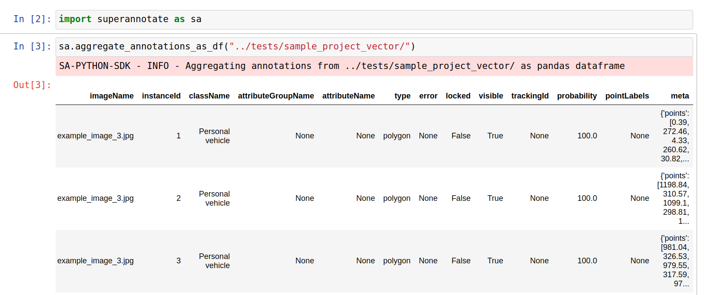
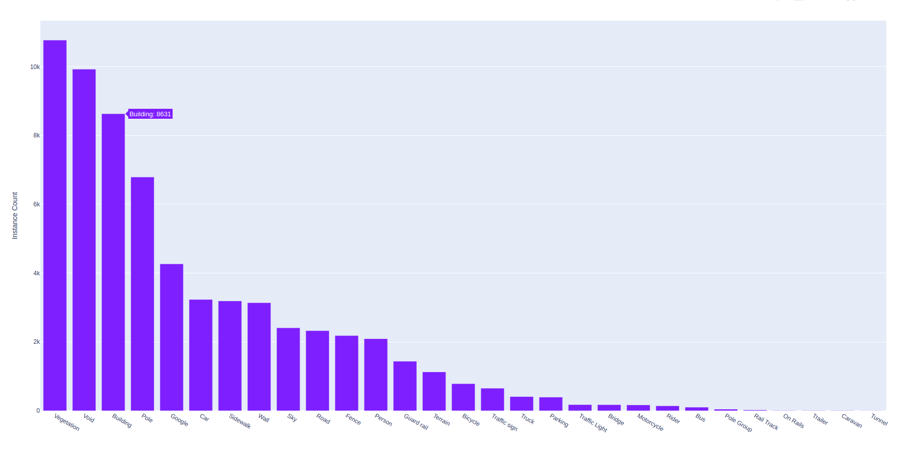
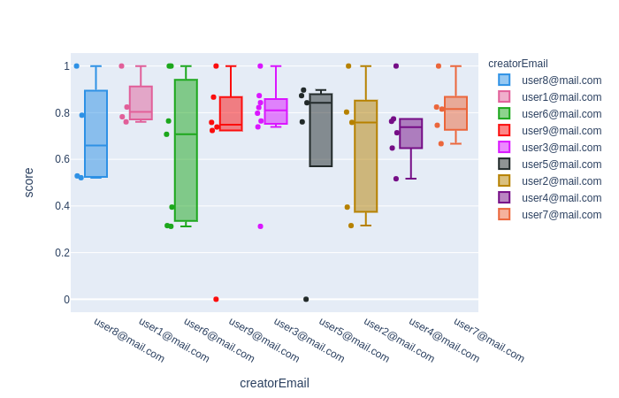
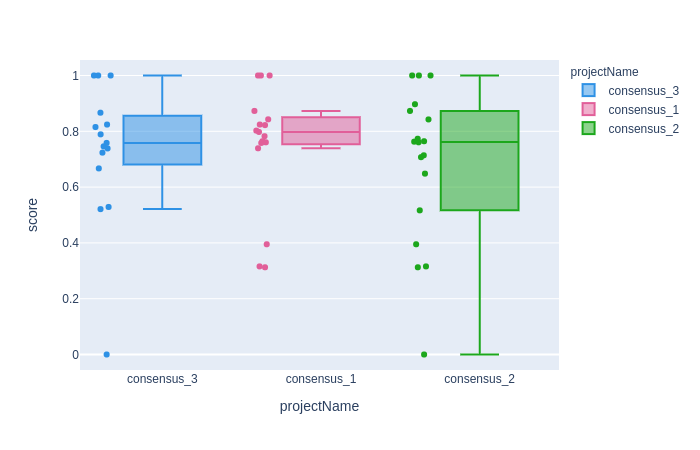
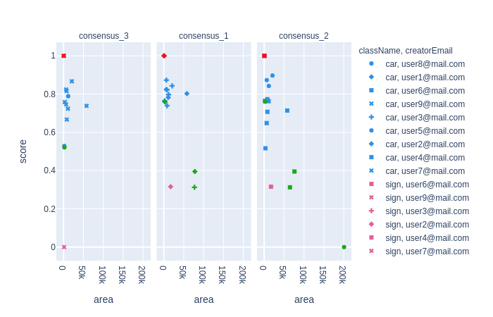
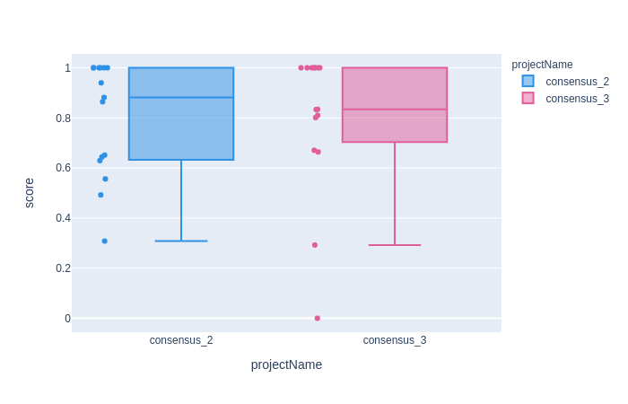
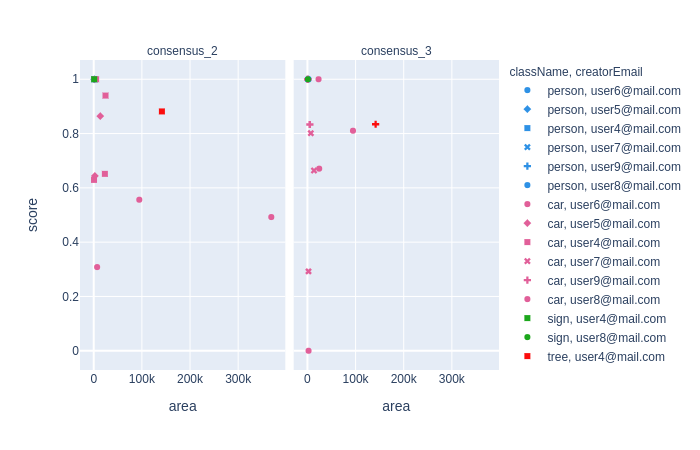

.. _ref_tutorial:

Tutorial
===========================

.. contents::

.. _ref_tutorial_installation:

Installation
____________

SDK is available on PyPI:

.. code-block:: bash

   pip install superannotate

The package officially supports Python 3.6+ and was tested under Linux and
Windows (`Anaconda <https://www.anaconda.com/products/individual#windows>`_) platforms.

For certain video related functions to work, ffmpeg package needs to be installed.
It can be installed on Ubuntu with:

.. code-block:: bash

   sudo apt-get install ffmpeg

For Windows and Mac OS based installations to use :py:obj:`benchmark` and :py:obj:`consensus`
functions you might also need to install beforehand :py:obj:`shapely` package,
which we found to work properly only under Anaconda distribution, with:

.. code-block:: bash

   conda install shapely

----------

Config file
____________________

To use the SDK, a config file with team specific authentication token needs to be
created.  The token is available to team admins on
team setting page at https://app.superannotate.com/team.

Default location config file
~~~~~~~~~~~~~~~~~~~~~~~~~~~~

To generate a default location (:file:`~/.superannotate/config.json`) config file,
:ref:`CLI init <ref_cli_init>` can be used:

.. code-block:: bash

   superannotatecli init

.. _ref_custom_config_file:

Custom config file
~~~~~~~~~~~~~~~~~~~~~~

To create a custom config file a new JSON file with key "token" can be created:

.. code-block:: json

   {
     "token" : "<team token>"
   }

----------

Initialization and authorization
________________________________

Include the package in your Python code:

.. code-block:: python

   from superannotate import SAClient

SDK is ready to be used if default location config file was created using 
the :ref:`CLI init <ref_cli_init>`. Otherwise to authenticate SDK with the :ref:`custom config file <ref_custom_config_file>`:

.. code-block:: python

   sa = SAClient(config_path="<path_to_config_json>")

Creating a project
____________________________

To create a new "Vector" project with name "Example Project 1" and description
"test":

.. code-block:: python

    project = "Example Project 1"

    sa.create_project(project, "test", "Vector")

.. warning::

   In general, SDK functions are not thread-safe.

Creating a folder in a project
______________________________

To create a new folder "folder1" in the project "Example Project 1":

.. code-block:: python

    sa.create_folder(project, "folder1")

After that point almost all SDK functions that use project name as argument can
point to that folder with slash after the project name, e.g.,
"Example Project 1/folder1", in this case.

Uploading images to project
____________________________

To upload all images with extensions "jpg" or "png" from the
:file:`"<local_folder_path>"` to the project "Example Project 1":

.. code-block:: python

    sa.upload_images_from_folder_to_project(project, "<local_folder_path>")

See the full argument options for
:py:func:`upload_images_from_folder_to_project` :ref:`here <ref_upload_images_from_folder_to_project>`.

For full list of available functions on projects, see :ref:`ref_projects`.

.. note::

   Python SDK functions that accept project argument will accept both project
   name or :ref:`project metadata <ref_metadata>` (returned either by 
   :ref:`get_project_metadata <ref_get_project_metadata>` or
   :ref:`search_projects <ref_search_projects>` with argument :py:obj:`return_metadata=True`). 
   If project name is used it should be unique in team's project list. Using project metadata will give
   performance improvement.

.. note::

    CLI command :ref:`upload-images <ref_upload_images>` can also be used for
    image upload.

.. note::

   To upload images to the "folder1" instead of the root of the project: 
   
      .. code-block:: python

         sa.upload_images_from_folder_to_project(project + "/folder1", "<local_folder_path>")

Working with annotation classes
_______________________________________________

An annotation class for a project can be created with SDK's:

.. code-block:: python

   sa.create_annotation_class(project, "Large car", color="#FFFFAA")

To create annotation classes in bulk with SuperAnnotate export format 
:file:`classes.json` (documentation at:
https://app.superannotate.com/documentation Management Tools
-> Project Workflow part): 

.. code-block:: python

   sa.create_annotation_classes_from_classes_json(project, "<path_to_classes_json>")

All of the annotation classes of a project are downloaded (as :file:`classes/classes.json`) with
:ref:`download_export <ref_download_export>` along with annotations, but they 
can also be downloaded separately with:

.. code-block:: python

   sa.download_annotation_classes_json(project, "<path_to_local_folder>")

The :file:`classes.json` file will be downloaded to :file:`"<path_to_local_folder>"` folder.

Working with annotations
_______________________________________________

The SuperAnnotate format annotation JSONs have the general form:

.. code-block:: json

  [ 
    {
      "className": "Human",
      "points" : "...",
      "..." : "..."
    },
    {
      "className": "Cat",
      "points" : "...",
      "..." : "..."
    },
    {
      "..." : "..."
    }
  ]

the "className" fields here will identify the annotation class of an annotation
object (polygon, points, etc.). The project
you are uploading to should contain annotation class with that name.

To upload annotations to platform:

.. code-block:: python

    sa.upload_annotations_from_folder_to_project(project, "<path_to_local_dir>")

This will try uploading to the project all the JSON files in the folder that have specific 
file naming convention. For vector
projects JSONs should be named :file:`"<image_name>___objects.json"`. For pixel projects
JSON files should be named :file:`"<image_name>___pixel.json"` and also for 
each JSON a mask image file should be present with the name 
:file:`"<image_name>___save.png"`. Image with :file:`<image_name>` should 
already be present in the project for the upload to work.

Exporting projects
__________________

To export the project annotations we need to prepare the export first:

.. code-block:: python

   export = sa.prepare_export(project, include_fuse=True)

We can download the prepared export with:

.. code-block:: python

   sa.download_export(project, export, "<local_folder_path>", extract_zip_contents=True)

:ref:`download_export <ref_download_export>` will wait until the export is
finished preparing and download it to the specified folder.

.. warning::

   Starting from version 1.9.0 :ref:`download_export <ref_download_export>` additionally
   requires :py:obj:`project` as first argument.

Converting annotation format
______________________________

After exporting project annotations (in SuperAnnotate format), it is possible
to convert them to other annotation formats:

.. code-block:: python

    sa.export_annotation("<input_folder>", "<output_folder>", "<dataset_format>", "<dataset_name>",
    "<project_type>", "<task>")

.. note::
    
  Right now we support only SuperAnnotate annotation format to COCO annotation format conversion, but you can convert from "COCO", "Pascal VOC", "DataLoop", "LabelBox", "SageMaker", "Supervisely", "VGG", "VoTT" or "YOLO" annotation formats to SuperAnnotate annotation format.

.. _git_repo: https://github.com/superannotateai/superannotate-python-sdk

You can find more information annotation format conversion :ref:`here <ref_converter>`. We provide some examples in our `GitHub repository <git_repo_>`_. In the root folder of our github repository, you can run following commands to do conversions.

.. code-block:: python

   from superannotate import export_annotation
   from superannotate import import_annotation

    # From SA format to COCO panoptic format
    export_annotation(
       "tests/converter_test/COCO/input/fromSuperAnnotate/cats_dogs_panoptic_segm",
       "tests/converter_test/COCO/output/panoptic",
       "COCO", "panoptic_test", "Pixel","panoptic_segmentation"
    )

    # From COCO keypoints detection format to SA annotation format
    import_annotation(
       "tests/converter_test/COCO/input/toSuperAnnotate/keypoint_detection",
       "tests/converter_test/COCO/output/keypoints",
       "COCO", "person_keypoints_test", "Vector", "keypoint_detection"
    )

    # Pascal VOC annotation format to SA annotation format
    import_annotation(
       "tests/converter_test/VOC/input/fromPascalVOCToSuperAnnotate/VOC2012",
       "tests/converter_test/VOC/output/instances",
       "VOC", "instances_test", "Pixel", "instance_segmentation"
    )

    # YOLO annotation format to SA annotation format
    import_annotation(
      'tests/converter_test/YOLO/input/toSuperAnnotate',
      'tests/converter_test/YOLO/output',
      'YOLO', '', 'Vector', 'object_detection'
      )

    # LabelBox annotation format to SA annotation format
    import_annotation(
       "tests/converter_test/LabelBox/input/toSuperAnnotate/",
       "tests/converter_test/LabelBox/output/objects/",
       "LabelBox", "labelbox_example", "Vector", "object_detection"
    )

    # Supervisely annotation format to SA annotation format
    import_annotation(
       "tests/converter_test/Supervisely/input/toSuperAnnotate",
       "tests/converter_test/Supervisely/output",
       "Supervisely", "", "Vector", "vector_annotation"
    )

    # DataLoop annotation format to SA annotation format
    import_annotation(
       "tests/converter_test/DataLoop/input/toSuperAnnotate",
       "tests/converter_test/DataLoop/output",
       "DataLoop", "", "Vector", "vector_annotation"
    )

    # VGG annotation format to SA annotation format
    import_annotation(
       "tests/converter_test/VGG/input/toSuperAnnotate",
       "tests/converter_test/VGG/output",
       "VGG", "vgg_test", "Vector", "instance_segmentation"
    )

    # VoTT annotation format to SA annotation format
    import_annotation(
       "tests/converter_test/VoTT/input/toSuperAnnotate",
       "tests/converter_test/VoTT/output",
       "VoTT", "", "Vector", "vector_annotation"
    )

    # GoogleCloud annotation format to SA annotation format
    import_annotation(
       "tests/converter_test/GoogleCloud/input/toSuperAnnotate",
       "tests/converter_test/GoogleCloud/output",
       "GoogleCloud", "image_object_detection", "Vector", "object_detection"
    )

    # GoogleCloud annotation format to SA annotation format
    import_annotation(
       "tests/converter_test/SageMaker/input/toSuperAnnotate",
       "tests/converter_test/SageMaker/output",
       "SageMaker", "test-obj-detect", "Vector", "object_detection"
    )

Working with images
_____________________

To download the image one can use:

.. code-block:: python

   image = "example_image1.jpg"

   sa.download_image(project, image, "<path_to_local_dir>")

To download image annotations:

.. code-block:: python

   sa.download_image_annotations(project, image, "<path_to_local_dir>")

Upload back to the platform with:

.. code-block:: python

   sa.upload_image_annotations(project, image, "<path_to_json>")

----------

Working with team contributors
______________________________

A team contributor can be invited to the team with:

.. code-block:: python

   sa.invite_contributors_to_team(emails=["admin@superannotate.com"], admin=False)

----------

pandas DataFrame out of project annotations and annotation instance filtering
_____________________________________________________________________________

To create a `pandas DataFrame <https://pandas.pydata.org/>`_ from project
SuperAnnotate format annotations:

.. code-block:: python

   df = sa.aggregate_annotations_as_df("<path_to_project_folder>")

The created DataFrame will have columns specified at
:ref:`aggregate_annotations_as_df <ref_aggregate_annotations_as_df>`.

Example of created DataFrame:

Each row represents annotation information. One full annotation with multiple
attribute groups can be grouped under :code:`instanceId` field.

----------

Aggregating class distribution across multiple projects
_______________________________________________________

After exporting annotations from multiple projects, it is possible to aggregate class distribution of annotated instances as follows

.. code-block:: python

   df = sa.class_distribution("<path_to_export_folder>", [project_names])

Aggregated distribution is returned as pandas dataframe with columns className and count. Enabling visualize flag plots histogram of obtained distribution.

.. code-block:: python

   df = sa.class_distribution("<path_to_export_folder>", [project_names], visualize = True)

----------

Working with DICOM files
_______________________________________________________

JPEG images with names :file:`<dicom_file_name>_<frame_num>.jpg` will be created
in :file:`<path_to_output_dir>`. Those JPEG images can be uploaded to
SuperAnnotate platform using the regular:

.. code-block:: python

   sa.upload_images_from_folder_to_project(project, "<path_to_output_dir>")

Some DICOM files can have image frames that are compressed. To load them, `GDCM :
Grassroots DICOM library <http://gdcm.sourceforge.net/wiki/index.php/Main_Page>`_ needs to be installed:

.. code-block:: bash

   # using conda
   conda install -c conda-forge gdcm

   # or on Ubuntu with versions above 19.04
   sudo apt install python3-gdcm

----------

Computing consensus scores for instances between several projects
_________________________________________________________________

Consensus is a tool to compare the quallity of the annotations of the same image that is present in several projects.
To compute the consensus scores:

.. code-block:: python

   res_df = sa.consensus([project_names], "<path_to_export_folder>", [image_list], "<annotation_type>")

Here pandas DataFrame with following columns is returned: creatorEmail, imageName, instanceId, className, area, attribute, projectName, score

.. image:: consensus_dataframe.png

Besides the pandas DataFrame there is an option to get the following plots by setting the show_plots flag to True:

* Box plot of consensus scores for each annotators
* Box plot of consensus scores for each project
* Scatter plots of consensus score vs instance area for each project

.. code-block:: python

   sa.consensus([project_names], "<path_to_export_folder>", [image_list], "<annotation_type>", show_plots=True)

To the left of each box plot the original score points of that annotator is depicted, the box plots are colored by annotator.

Analogically the box plots of consensus scores for each project are colored according to project name.

Scatter plot of consensus score vs instance area is separated by projects. Hovering on a point reveals its annotator and image name. 
The points are colored according to class name. Each annotator is represented with separate symbol.

----------

Computing benchmark scores for instances between ground truth project and given project list
____________________________________________________________________________________________

Benchmark is a tool to compare the quallity of the annotations of the same image that is present in several projects with 
the ground truth annotation of the same image that is in a separate project.

To compute the benchmark scores:

.. code-block:: python

   res_df = sa.benchmark("<ground_truth_project_name>",[project_names], "<path_to_export_folder>", [image_list], "<annotation_type>")

Here pandas DataFrame with exactly same structure as in case of consensus computation is returned.

Besides the pandas DataFrame there is an option to get the following plots by setting the show_plots flag to True:

* Box plot of benchmark scores for each annotators
* Box plot of benchmark scores for each project
* Scatter plots of benchmark score vs instance area for each project

.. code-block:: python

   sa.benchmark("<ground_truth_project_name>", [project_names], "<path_to_export_folder>", [image_list], "<annotation_type>", show_plots=True)

To the left of each box plot the original score points of that annotator is depicted, the box plots are colored by annotator.

.. image:: benchmark_annotators_box.png

Analogically the box plots of benchmark scores for each project are colored according to project name.

Scatter plot of benchmark score vs instance area is separated by projects. Hovering on a point reveals its annotator and image name. 
The points are colored according to class name. Each annotator is represented with separate symbol.

