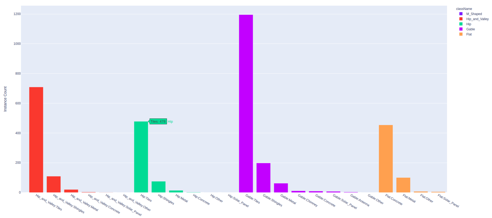

.. _ref_tutorial:

Tutorial
===========================

.. contents::

.. _ref_tutorial_installation:

Installation
____________

SDK is available on PyPI:

.. code-block:: bash

   pip install superannotate

for COCO annotation format converters support also need to install:

.. code-block:: bash

   pip install 'git+https://github.com/cocodataset/panopticapi.git'
   pip install 'git+https://github.com/philferriere/cocoapi.git#egg=pycocotools&subdirectory=PythonAPI'

The package officially supports Python 3.6+.

----------

Config file
____________________

To use the SDK, a config file with team specific authentication token needs to be
created.  The token is available to team admins on
team setting page at https://app.superannotate.com/team.

Default location config file
~~~~~~~~~~~~~~~~~~~~~~~~~~~~

To generate a default location (:file:`~/.superannotate/config.json`) config file,
:ref:`CLI init <ref_cli_init>` can be used:

.. code-block:: bash

   superannotate init

.. _ref_custom_config_file:

Custom config file
~~~~~~~~~~~~~~~~~~~~~~

To create a custom config file a new JSON file with key "token" can be created:

.. code-block:: json

   {
     "token" : "<team token>"
   }

----------

Initialization and authorization
________________________________

Include the package in your Python code:

.. code-block:: python

   import superannotate as sa

SDK is ready to be used if default location config file was created using 
the :ref:`CLI init <ref_cli_init>`. Otherwise to authenticate SDK with the :ref:`custom config file <ref_custom_config_file>`:

.. code-block:: python

   sa.init("<path_to_config_json>")

Creating a project
____________________________

To create a new "Vector" project with name "Example Project 1" and description
"test":

.. code-block:: python

    project = "Example Project 1"

    sa.create_project(project, "test", "Vector")

Uploading images to project
____________________________

To upload all images with extensions "jpg" or "png" from the
:file:`"<local_folder_path>"` to the project "Example Project 1":

.. code-block:: python

    sa.upload_images_from_folder_to_project(project, "<local_folder_path>")

See the full argument options for
:py:func:`upload_images_from_folder_to_project` :ref:`here <ref_upload_images_from_folder_to_project>`.

For full list of available functions on projects, see :ref:`ref_projects`.

.. note::

   Python SDK functions that accept project argument will accept both project
   name or :ref:`project metadata <ref_metadata>` (returned either by 
   :ref:`get_project_metadata <ref_get_project_metadata>` or
   :ref:`search_projects <ref_search_projects>` with argument :py:obj:`return_metadata=True`). 
   If project name is used it should be unique in team's project list. Using project metadata will give
   performance improvement.

.. note::

    CLI command :ref:`upload-images <ref_upload_images>` can also be used for
    image upload.

Working with annotation classes
_______________________________________________

An annotation class for a project can be created with SDK's:

.. code-block:: python

   sa.create_annotation_class(project, "Large car", color="#FFFFAA")

To create annotation classes in bulk with SuperAnnotate export format 
:file:`classes.json` (documentation at:
https://app.superannotate.com/documentation Management Tools
-> Project Workflow part): 

.. code-block:: python

   sa.create_annotation_classes_from_classes_json(project, "<path_to_classes_json>")

All of the annotation classes of a project are downloaded (as :file:`classes/classes.json`) with
:ref:`download_export <ref_download_export>` along with annotations, but they 
can also be downloaded separately with:

.. code-block:: python

   sa.download_annotation_classes_json(project, "<path_to_local_folder>")

The :file:`classes.json` file will be downloaded to :file:`"<path_to_local_folder>"` folder.

Working with annotations
_______________________________________________

The SuperAnnotate format annotation JSONs have the general form:

.. code-block:: json

  [ 
    {
      "className": "Human",
      "points" : "...",
      "..." : "..."
    },
    {
      "className": "Cat",
      "points" : "...",
      "..." : "..."
    },
    {
      "..." : "..."
    }
  ]

the "className" fields here will identify the annotation class of an annotation
object (polygon, points, etc.). The project
you are uploading to should contain annotation class with that name.

To upload annotations to platform:

.. code-block:: python

    sa.upload_annotations_from_folder_to_project(project, "<path_to_local_dir>")

This will try uploading to the project all the JSON files in the folder that have specific 
file naming convention. For vector
projects JSONs should be named :file:`"<image_name>___objects.json"`. For pixel projects
JSON files should be named :file:`"<image_name>___pixel.json"` and also for 
each JSON a mask image file should be present with the name 
:file:`"<image_name>___save.png"`. Image with :file:`<image_name>` should 
already be present in the project for the upload to work.

You can add an annotation to local annotations JSON with:

.. code-block:: python

   sa.add_annotation_bbox_to_json("<path_to_json>", [10, 10, 100, 100],
                                  "Human")

Exporting projects
__________________

To export the project annotations we need to prepare the export first:

.. code-block:: python

   export = sa.prepare_export(project, include_fuse=True)

We can download the prepared export with:

.. code-block:: python

   sa.download_export(project, export, "<local_folder_path>", extract_zip_contents=True)

:ref:`download_export <ref_download_export>` will wait until the export is
finished preparing and download it to the specified folder.

.. warning::

   Starting from version 1.9.0 :ref:`download_export <ref_download_export>` additionally
   requires :py:obj:`project` as first argument.

Converting annotation format
______________________________

After exporting project annotations (in SuperAnnotate format), it is possible
to convert them to other annotation formats:

.. code-block:: python

    sa.export_annotation_format("<input_folder>", "<output_folder>", "<dataset_format>", "<dataset_name>", 
    "<project_type>", "<task>", "<platform>")

.. note::
    
  Right now we support only SuperAnnotate annotation format to COCO annotation format conversion, but you can convert from "COCO", "Pascal VOC" or "LabelBox" annotation formats to SuperAnnotate annotation format.

.. _git_repo: https://github.com/superannotateai/superannotate-python-sdk

You can find more information annotation format conversion :ref:`here <ref_converter>`. We provide some examples in our `GitHub repository <git_repo_>`_. In the root folder of our github repository, you can run following commands to do conversions.

.. code-block:: python

   import superannotate as sa

    # From SA panoptic format to COCO panoptic format
    sa.export_annotation_format(
       "tests/converter_test/COCO/input/fromSuperAnnotate/cats_dogs_panoptic_segm", 
       "tests/converter_test/COCO/output/panoptic",
       "COCO", "panoptic_test", "Pixel","panoptic_segmentation","Web"
    )

    # From COCO keypoints detection format to SA keypoints detection desktop application format 
    sa.import_annotation_format(
       "tests/converter_test/COCO/input/toSuperAnnotate/keypoint_detection",
       "tests/converter_test/COCO/output/keypoints",
       "COCO", "person_keypoints_test", "Vector", "keypoint_detection", "Desktop"
    )

    # Pascal VOC annotation format to SA Web platform annotation format
    sa.import_annotation_format(
       "tests/converter_test/VOC/input/fromPascalVOCToSuperAnnotate/VOC2012",
       "tests/converter_test/VOC/output/instances",
       "VOC", "instances_test", "Pixel", "instance_segmentation", "Web"
    )

    # LabelBox annotation format to SA Desktop application annotation format
    sa.import_annotation_format(
       "tests/converter_test/LabelBox/input/toSuperAnnotate/",
       "tests/converter_test/LabelBox/output/objects/",
       "LabelBox", "labelbox_example", "Vector", "object_detection", "Desktop"
    )

Working with images
_____________________

To download the image one can use:

.. code-block:: python

   image = "example_image1.jpg"

   sa.download_image(project, image, "<path_to_local_dir>")

To download image annotations:

.. code-block:: python

   sa.download_image_annotations(project, image, "<path_to_local_dir>")

After the image annotations are downloaded, you can add annotations to it:

.. code-block:: python

   sa.add_annotation_bbox_to_json("<path_to_json>", [10, 10, 100, 100],
                                  "Human")

and upload back to the platform with:

.. code-block:: python

   sa.upload_annotations_from_json_to_image(project, image, "<path_to_json>")

Last two steps can be combined into one:

.. code-block:: python

   sa.add_annotation_bbox_to_image(project, image, [10, 10, 100, 100], "Human")

but if bulk changes are made to many images it is much faster to add all required
annotations using :ref:`add_annotation_bbox_to_json
<ref_add_annotation_bbox_to_json>` 
then upload them using
:ref:`upload_annotations_from_folder_to_project
<ref_upload_images_from_folder_to_project>`.

----------

Working with team contributors
______________________________

A team contributor can be invited to the team with:

.. code-block:: python

   sa.invite_contributor_to_team(email="hovnatan@superannotate.com", admin=False)

This invitation should be accepted by the contributor. After which, to share the 
project with the found contributor as an QA:

.. code-block:: python

   sa.share_project(project, "hovnatan@superannotate.com", user_role="QA")

----------

pandas DataFrame out of project annotations and annotation instance filtering
_____________________________________________________________________________

To create a `pandas DataFrame <https://pandas.pydata.org/>`_ from project
SuperAnnotate format annotations:

.. code-block:: python

   df = sa.aggregate_annotations_as_df("<path_to_project_folder>")

The created DataFrame will have columns :code:`imageName`, :code:`instanceId`,
:code:`className`, :code:`attributeGroupName`, :code:`attributeName`, :code:`type`, :code:`error`, :code:`locked`, :code:`visible`, :code:`trackingId`, :code:`probability`, :code:`pointLabels`, :code:`meta` (geometry information as string), :code:`commentResolved`, :code:`classColor`.

Example of created DataFrame:

.. image:: pandas_df.png

Each row represents annotation information. One full annotation with multiple
attribute groups can be grouped under :code:`instanceId` field.

A helper function :ref:`filter_annotation_instances <ref_filter_annotation_instances>` to annotation instances by their class or attribute from the DataFrame is available. E.g., to get annotations that have annotation class :code:`Human` and attribute  :code:`"height" : "tall"`  that are **not** of type :code:`polygon`:

.. code-block:: python

   filtered_df = sa.filter_annotation_instances(df, include=[{"className" : "Human",
                                                              "attributes" : [{"groupName" : "height",
                                                                              "name" : "tall"}]
                                                            }],
                                                    exclude=[{"type" : "polygon"}])

To transform back pandas DataFrame annotations to SuperAnnotate format annotation:

.. code-block:: python

   sa.df_to_annotations(filtered_df, "<path_to_output_folder>")

----------

Aggregating class distribution across multiple projects
_______________________________________________________

After exporting annotations from multiple projects, it is possible to aggregate class distribution of annotated instances as follows

.. code-block:: python

   df = sa.class_distribution("<path_to_export_folder>", [project_names])

Aggregated distribution is returned as pandas dataframe with columns className and count. Enabling visualize flag plots histogram of obtained distribution.

.. code-block:: python

   df = sa.class_distribution("<path_to_export_folder>", [project_names], visualize = True)

.. image:: class_distribution.png

Similarly aggregation of class attributes across multiple projects can be obtained with

.. code-block:: python

   df = sa.attribute_distribution("<path_to_export_folder>", [project_names], visualize = True)

Here pandas DataFrame with columns identifying attribute and corresponding instance count is returned. Within visualized histogram attributes of the same class are grouped by color and sorted accordingly.

----------

Working with DICOM files
_______________________________________________________

To convert DICOM file images to JPEG images:

.. code-block:: python

   df = sa.dicom_to_rgb_sequence("<path_to_dicom_file>", "<path_to_output_dir>")

JPEG images with names :file:`<dicom_file_name>_<frame_num>.jpg` will be created
in :file:`<path_to_output_dir>`. Those JPEG images can be uploaded to
SuperAnnotate platform using the regular:

.. code-block:: python

   sa.upload_images_from_folder_to_project(project, "<path_to_output_dir>")

Some DICOM files can have image frames that are compressed. To load them, `GDCM :
Grassroots DICOM library <http://gdcm.sourceforge.net/wiki/index.php/Main_Page>`_ needs to be installed:

.. code-block:: bash

   # using conda
   conda install -c conda-forge gdcm

   # or on Ubuntu with versions above 19.04
   sudo apt install python3-gdcm
