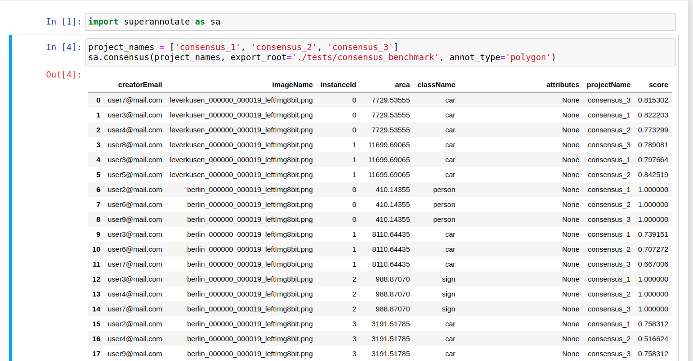

==========
Utilities
==========

Converting annotation format
============

After exporting project annotations (in SuperAnnotate format), it is possible
to convert them to other annotation formats:

.. code-block:: python

    sa.export_annotation("<input_folder>", "<output_folder>", "<dataset_format>", "<dataset_name>",
    "<project_type>", "<task>")

.. note::

  Right now we support only SuperAnnotate annotation format to COCO annotation format conversion, but you can convert from "COCO", "Pascal VOC", "DataLoop", "LabelBox", "SageMaker", "Supervisely", "VGG", "VoTT" or "YOLO" annotation formats to SuperAnnotate annotation format.

.. _git_repo: https://github.com/superannotateai/superannotate-python-sdk

You can find more information annotation format conversion :ref:`here <ref_converter>`. We provide some examples in our `GitHub repository <git_repo_>`_. In the root folder of our github repository, you can run following commands to do conversions.

.. code-block:: python

   from superannotate import export_annotation
   from superannotate import import_annotation

    # From SA format to COCO panoptic format
    export_annotation(
       "tests/converter_test/COCO/input/fromSuperAnnotate/cats_dogs_panoptic_segm",
       "tests/converter_test/COCO/output/panoptic",
       "COCO", "panoptic_test", "Pixel","panoptic_segmentation"
    )

    # From COCO keypoints detection format to SA annotation format
    import_annotation(
       "tests/converter_test/COCO/input/toSuperAnnotate/keypoint_detection",
       "tests/converter_test/COCO/output/keypoints",
       "COCO", "person_keypoints_test", "Vector", "keypoint_detection"
    )

    # Pascal VOC annotation format to SA annotation format
    import_annotation(
       "tests/converter_test/VOC/input/fromPascalVOCToSuperAnnotate/VOC2012",
       "tests/converter_test/VOC/output/instances",
       "VOC", "instances_test", "Pixel", "instance_segmentation"
    )

    # YOLO annotation format to SA annotation format
    import_annotation(
      'tests/converter_test/YOLO/input/toSuperAnnotate',
      'tests/converter_test/YOLO/output',
      'YOLO', '', 'Vector', 'object_detection'
      )

    # LabelBox annotation format to SA annotation format
    import_annotation(
       "tests/converter_test/LabelBox/input/toSuperAnnotate/",
       "tests/converter_test/LabelBox/output/objects/",
       "LabelBox", "labelbox_example", "Vector", "object_detection"
    )

    # Supervisely annotation format to SA annotation format
    import_annotation(
       "tests/converter_test/Supervisely/input/toSuperAnnotate",
       "tests/converter_test/Supervisely/output",
       "Supervisely", "", "Vector", "vector_annotation"
    )

    # DataLoop annotation format to SA annotation format
    import_annotation(
       "tests/converter_test/DataLoop/input/toSuperAnnotate",
       "tests/converter_test/DataLoop/output",
       "DataLoop", "", "Vector", "vector_annotation"
    )

    # VGG annotation format to SA annotation format
    import_annotation(
       "tests/converter_test/VGG/input/toSuperAnnotate",
       "tests/converter_test/VGG/output",
       "VGG", "vgg_test", "Vector", "instance_segmentation"
    )

    # VoTT annotation format to SA annotation format
    import_annotation(
       "tests/converter_test/VoTT/input/toSuperAnnotate",
       "tests/converter_test/VoTT/output",
       "VoTT", "", "Vector", "vector_annotation"
    )

    # GoogleCloud annotation format to SA annotation format
    import_annotation(
       "tests/converter_test/GoogleCloud/input/toSuperAnnotate",
       "tests/converter_test/GoogleCloud/output",
       "GoogleCloud", "image_object_detection", "Vector", "object_detection"
    )

    # GoogleCloud annotation format to SA annotation format
    import_annotation(
       "tests/converter_test/SageMaker/input/toSuperAnnotate",
       "tests/converter_test/SageMaker/output",
       "SageMaker", "test-obj-detect", "Vector", "object_detection"
    )

pandas DataFrame out of project annotations and annotation instance filtering
============

To create a `pandas DataFrame <https://pandas.pydata.org/>`_ from project
SuperAnnotate format annotations:

.. code-block:: python

   df = sa.aggregate_annotations_as_df("<path_to_project_folder>")

The created DataFrame will have columns specified at
:ref:`aggregate_annotations_as_df <ref_aggregate_annotations_as_df>`.

Example of created DataFrame:

.. image:: images/pandas_df.png

Each row represents annotation information. One full annotation with multiple
attribute groups can be grouped under :code:`instanceId` field.

Working with DICOM files
============

JPEG images with names :file:`<dicom_file_name>_<frame_num>.jpg` will be created
in :file:`<path_to_output_dir>`. Those JPEG images can be uploaded to
SuperAnnotate platform using the regular:

.. code-block:: python

   sa.upload_images_from_folder_to_project(project, "<path_to_output_dir>")

Some DICOM files can have image frames that are compressed. To load them, `GDCM :
Grassroots DICOM library <http://gdcm.sourceforge.net/wiki/index.php/Main_Page>`_ needs to be installed:

.. code-block:: bash

   # using conda
   conda install -c conda-forge gdcm

   # or on Ubuntu with versions above 19.04
   sudo apt install python3-gdcm

Computing consensus scores for instances between several projects
============

Consensus is a tool to compare the quallity of the annotations of the same image that is present in several projects.
To compute the consensus scores:

.. code-block:: python

   res_df = sa.consensus([project_names], "<path_to_export_folder>", [image_list], "<annotation_type>")

Here pandas DataFrame with following columns is returned: creatorEmail, imageName, instanceId, className, area, attribute, projectName, score

Besides the pandas DataFrame there is an option to get the following plots by setting the show_plots flag to True:

* Box plot of consensus scores for each annotators
* Box plot of consensus scores for each project
* Scatter plots of consensus score vs instance area for each project

.. code-block:: python

   sa.consensus([project_names], "<path_to_export_folder>", [image_list], "<annotation_type>", show_plots=True)

To the left of each box plot the original score points of that annotator is depicted, the box plots are colored by annotator.

.. image:: images/consensus_annotators_box.png

Analogically the box plots of consensus scores for each project are colored according to project name.

.. image:: images/consensus_projects_box.png

Scatter plot of consensus score vs instance area is separated by projects. Hovering on a point reveals its annotator and image name.
The points are colored according to class name. Each annotator is represented with separate symbol.

.. image:: images/consensus_scatter.png

Computing benchmark scores for instances between ground truth project and given project list
============

Benchmark is a tool to compare the quallity of the annotations of the same image that is present in several projects with
the ground truth annotation of the same image that is in a separate project.
